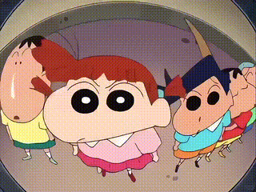

## hello！我是 eleven-mouse

### 关于我

#### 博客: https://kunxing-blog.top

- 大二在读，持续努力学习中...
- 喜欢做没人要求但可能有人需要的小工具
  _"如果工具不存在，就自己造一个"_

> `ERROR 404` — 社交生活未找到。用代码填补中....
>
> _有 bug？那不是 bug，那是 feature。_
>
> _"为什么这个 PR 只改了一行？" — 别问，问就是重构。_

### 🛠 技术栈

- 💻 &#160; 
  
- 🌐 &#160;
  
  
  
  

- 🛢 &#160;  
  
  
- 🔧 &#160; 
  
  
  

<picture>
  <source media="(prefers-color-scheme: dark)" srcset="https://raw.githubusercontent.com/Eleven-Mouse/Eleven-Mouse/output/github-snake-dark.svg" />
  <source media="(prefers-color-scheme: light)" srcset="https://raw.githubusercontent.com/Eleven-Mouse/Eleven-Mouse/output/github-snake.svg" />
  
</picture>

_"让 AI 干活，我来思考"_

### 🌙

凌晨两点还在翻文档，嘴上说着"随便看看"

_bug 总是在深夜被修复_

> _I love to make friends. so if you want to say hi, I'll be happy to meet you more!😊_

⭐️ From [Eleven-Mouse](https://github.com/Eleven-Mouse)
